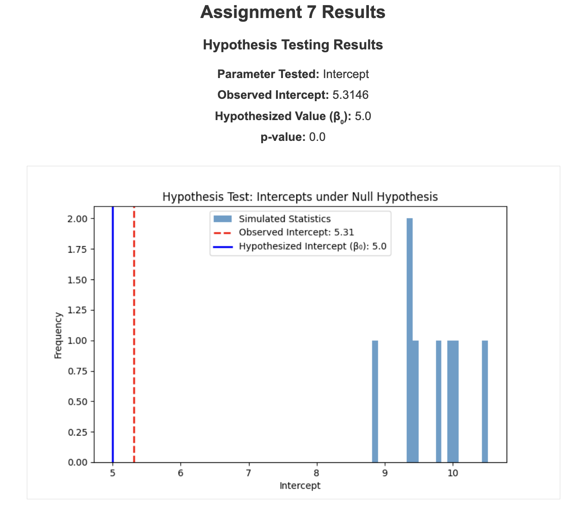

# Hypothesis Testing and Confidence Intervals in Linear Regression

In this assignment, you'll use your previous work from Assignment 6 to include hypothesis testing and confidence intervals through simulations. You'll extend your interactive webpage to allow users to perform hypothesis tests on the slope or intercept of the regression line and generate confidence intervals based on simulations. Download the starter code [here](assignment7_starter_code.zip).

## Task Overview

In addition to the features implemented in your website on Assignment 6, you must implement the following features:

### 1. Hypothesis Testing

- **Workflow**:
  - **First**, users will generate data using the specified parameters (done in Assignment 6).
  - **Next**, they can choose to perform hypothesis testing based on the generated data (new for this assignment).

- **User Inputs**:
  - **Parameter to Test**: Allow the user to select whether to test the **slope** or **intercept**.
  - **Type of Test**:
    - **Greater than ( > )**
    - **Less than ( < )**
    - **Not equal to ( ≠ )**

- **Null Hypothesis**:
  - The null hypothesis will use the **original slope or intercept specified during data generation**.

- **Simulation**:
  - Run simulations to generate the distribution of the slope or intercept under the null hypothesis.
  - Display a histogram of the simulated slopes or intercepts.
  - Show the region of the histogram that provides evidence against the null hypothesis.
  - Calculate and display the **p-value** based on the simulations.
  - Add a fun message when the p-value is extremely small (p ≤ 0.0001).

### 2. Confidence Intervals

- **User Inputs**:
  - **Confidence Level**: Allow the user to select a confidence level (e.g., 90%, 95%, 99%).

- **Simulation**:
  - Run simulations to generate confidence intervals for the slope or intercept.
  - Count the number of times the confidence intervals capture the true parameter value.
  - Display the proportion of intervals that contain the true value.
  - Plot the confidence intervals and show those that do not contain the true parameter value.

## Instructions

1. **Extend Your Existing Code**:
   - Use your code from Assignment 6 as a starting point.
   - **Add new input fields for users to specify the intercept (β₀) and slope (β₁)**, along with the mean (μ) and variance (σ²).
   - Update the data generation to use these user-specified values.
   - **Note**: The null hypothesis in your hypothesis testing will use these specified β₀ and β₁ values.

2. **Modify the Webpage Workflow**:

   - **Data Generation**:
     - Users input parameters for data generation and click a **"Generate Data"** button.
     - Display the plots related to data generation (scatter plot, histograms).

   - **Hypothesis Testing**:
     - After generating data, users can input parameters for hypothesis testing.
     - Provide a **"Run Hypothesis Testing"** button under the data generation results.
     - The hypothesis testing should be based on the generated data.

   - **Confidence Intervals**:
     - Similarly, provide options for generating confidence intervals.
     - Include a **"Calculate Confidence Interval"** button.

3. **Hypothesis Testing Implementation**:

   - **Data Generation**:
     - Use the parameters specified during data generation (β₀ and β₁) as the null hypothesis values.
     - For simulations under the null hypothesis, generate datasets using the original parameters:
       - `Y = β₀ + β₁ * X + μ + error`

   - **Simulation**:
     - Run `S` simulations under the null hypothesis using the **original β₀ and β₁ values specified during data generation**.
     - For each simulation:
       - Generate a dataset using `Y = β₀ + β₁ * X + μ + error`.
       - Compute the slope or intercept for each simulated dataset.
     - Store these values to create the distribution under the null hypothesis.

   - **Calculating p-value**:
     - Based on the type of test ( > , < , ≠ ), calculate the proportion of simulated statistics that are as extreme or more extreme than the observed statistic from your sample.
     - **For example**:
       - **Greater than**: `p-value = (number of simulated stats ≥ observed stat) / S`
       - **Less than**: `p-value = (number of simulated stats ≤ observed stat) / S`
       - **Not equal to**: `p-value = (number of simulated stats as extreme as observed stat) / S`

   - **Handling Small p-values**:
      - Add code to display a fun message when the p-value is extremely small (e.g., ≤ 0.0001).
      - This message should inform the user that they have encountered a rare event.

   - **Visualization**:
     - Plot a histogram of the simulated statistics.
     - Mark the observed statistic on the histogram.
     - See below for an example of a histogram with a p-value calculation.

      

4. **Confidence Intervals Implementation**:

   - **Simulation**:
     - For each of the `S` simulations, generate a bootstrap sample (resample with replacement from your original dataset).
     - Compute the slope or intercept for each bootstrap sample.
     - Construct confidence intervals using the percentile method based on the simulated statistics.

   - **Visualization and Analysis**:
     - Plot all the confidence intervals.
     - Calculate and display the proportion of intervals that contain the true parameter value.
     - See below for an example of confidence intervals with the true parameter value marked.

      

5. **New User Inputs**:

   - Update your webpage to include new input fields and options for:
     - Selecting the parameter to test (slope or intercept).
     - Choosing the type of hypothesis test.
     - Selecting the confidence level for intervals.

6. **Create a Short Demo Video (2-3 minutes)**:

   - Explain the new additions to the webpage.
     - Demonstrate your application with different inputs.
     - Explain how the hypothesis testing works in your simulation.
     - Interpret the p-values obtained.
     - Describe how the confidence intervals are constructed and their significance.
     - Share any interesting patterns or observations from your experiments.
   - Record your screen while doing a voiceover narrating the above content.

7. **Submission**:

   - **Code**:
     - Submit your completed code as a GitHub repository on your portfolio website as you have done for previous assignments.

   - **Demo Video**:
     - Embed your video in your portfolio website either directly or from YouTube.
     - Include the link to the video in your assignment repository's README file.